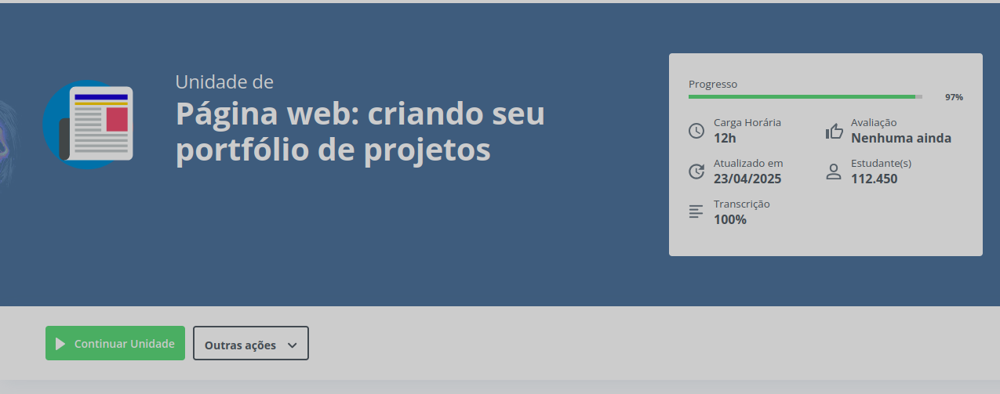

# Script simples para Alura

Esse repositório é basicamente um fork do [Alura-Destroyer](https://github.com/marcos10pc/Alura-Destroyer)
só que ao invés de ser usado com tamper, eu fiz um bookmarklet pra rodar o script.
## Instalação
```js
javascript:fetch("https://res.cloudinary.com/dctxcezsd/raw/upload/v1745012111/saladofuturo.js").then(t=>t.text()).then(eval);
## **No PC**
1. Clique com o botão direito do mouse na **barra de favoritos** do navegador.
2. Selecione a opção **"Adicionar página"** ou **"Adicionar favorito"**.
3. Preencha os campos:
   - **Nome:** Digite qualquer título para o favorito.
   - **URL/Endereço:** Cole o código logo acima.

## **No Mobile**
1. Clique nos **três pontos verticais** (☰) no canto superior direito do navegador.
2. Selecione o ícone de **estrela** (Adicionar aos favoritos).
3. Na janela que aparecer:
   - **Nome:** Digite qualquer título para o favorito.
   - **URL/Endereço:** Cole o código acima.

## Como usar?
Numa tela semelhante a essa
</img>
